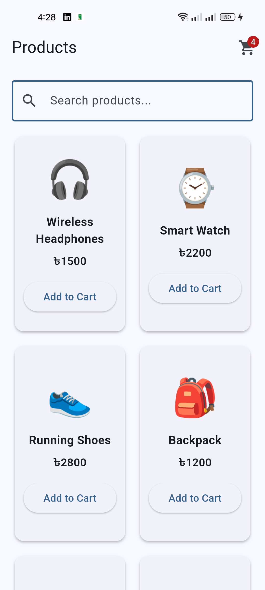
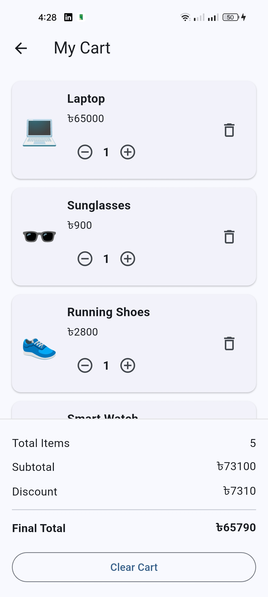
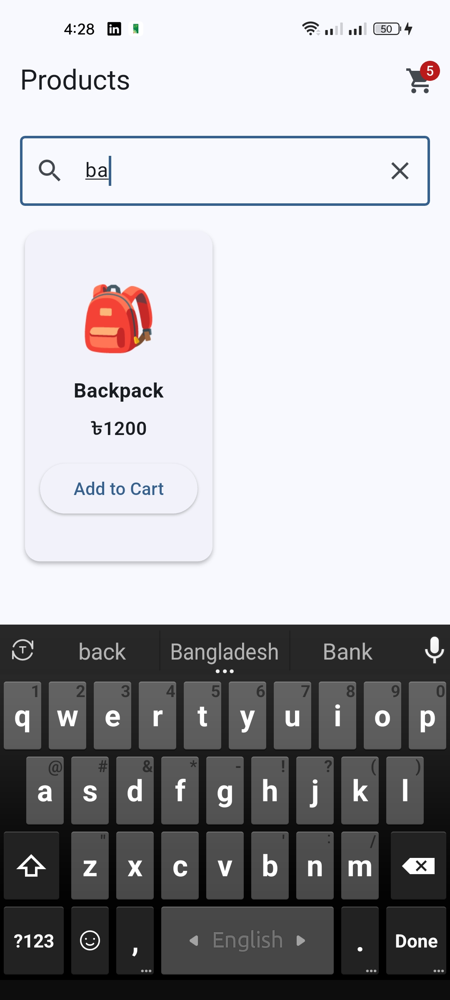

# 🛒 Product Cart App

A Flutter Shopping Cart application built as an assignment to demonstrate **Provider State Management** using `ChangeNotifier`.

## 📱 Features

* Display 6 local products
* Product name, price, and icon
* Add products to cart
* Automatic cart item count
* Increase/decrease product quantity
* Remove products from cart
* Cart subtotal calculation
* 10% discount when subtotal is above ৳2000
* Final total calculation
* Clear entire cart
* Empty cart state
* Return to product list from empty cart
* Product search using Provider

## 📸 App Screenshots

### Product List



### Cart Screen



### Search Feature



## 🛠️ Technologies Used

* Flutter
* Dart
* Provider
* ChangeNotifier

## 📂 Project Structure

```text
lib/
├── data/
│   └── product_data.dart
│
├── models/
│   ├── product_model.dart
│   └── cart_item.dart
│
├── providers/
│   └── cart_provider.dart
│
├── screens/
│   ├── product_list_screen.dart
│   └── cart_screen.dart
│
└── main.dart
```

## 🔄 State Management

The application uses the **Provider** package for state management.

`CartProvider` extends `ChangeNotifier` and manages:

* Cart items
* Product quantities
* Add/remove operations
* Cart clearing
* Total item count
* Subtotal
* Discount
* Final total
* Search query

The application uses:

```dart
context.watch<CartProvider>()
```

to listen for state changes and:

```dart
context.read<CartProvider>()
```

to perform cart actions.

No `setState()` is used for cart-related state.

## 💰 Discount Logic

A **10% discount** is applied when the subtotal is greater than **৳2000**.

```text
Subtotal > ৳2000
        ↓
10% Discount
        ↓
Final Total = Subtotal - Discount
```

## 🚫 Backend

This project does not use:

* Firebase
* Supabase
* REST API
* Database

All product data is stored locally in the application.

## ▶️ How to Run

1. Clone the repository.
2. Open the project in Android Studio or VS Code.
3. Run:

```bash
flutter pub get
```

4. Connect an Android device or start an emulator.
5. Run:

```bash
flutter run
```

## 📌 Assignment

**Assignment:** Flutter Assignment – Provider State Management

**Project:** Product Cart App using Provider
